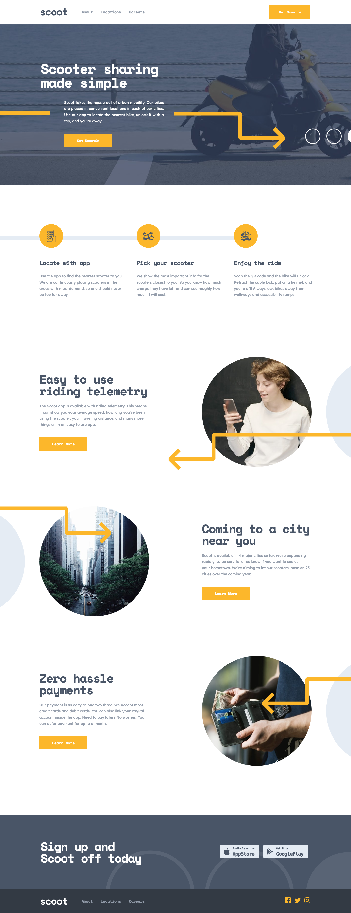
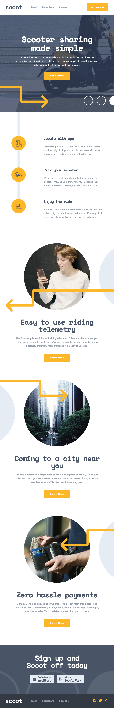
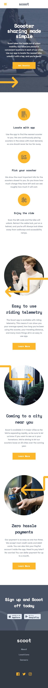

# Frontend Mentor - Scoot website solution

This is a solution to the [Scoot website challenge on Frontend Mentor](https://www.frontendmentor.io/challenges/scoot-multipage-website-N76alNPRJ). Frontend Mentor challenges help you improve your coding skills by building realistic projects.

## Table of contents

- [Overview](#overview)
  - [The challenge](#the-challenge)
  - [Screenshot](#screenshot)
  - [Links](#links)
- [My process](#my-process)
  - [Built with](#built-with)
  - [What I learned](#what-i-learned)
  - [Continued development](#continued-development)
- [Author](#author)

## Overview

### The challenge

Users should be able to:

- View the optimal layout for each page depending on their device's screen size
- See hover states for all interactive elements throughout the site

### Screenshot





### Links

- [Solution URL](https://github.com/vinhyan/scoot.git)
- [Live Site URL](https://vinhyan.github.io/scoot/)

## My process

### Built with

- Semantic HTML5 markup
- CSS custom properties
- Flexbox
- [React](https://reactjs.org/) - JS library
- [Styled Components](https://styled-components.com/) - For styles
- [Framer Motion](https://www.framer.com/motion/) - For animations

### What I learned

1. How to style a React project using Styled Components:

- Learned how to create global style using `{ createGlobalStyle }`.
- Learned how to use props to manipulate styles within styled components -> this is my one of my favourtie features of Styled Components.
- For responsiveness: media query has to be added separately to each styled component -> can be a bit of work but I got used to it easily.
- Learned how to work with Framer Motion using Styled Components.

2. Create reusable components with React:

- I like creating components that can be reused throughout the project. Passing data through props without having to re-write HTML tags and classes saved me lots of time.
- Below is a reusable component I created which allow elements' position to be reversed (for styling purposes), with or without button and personalized button's content, all can be done by passing props:

```
const Card = ({
  title,
  content,
  buttonContent,
  featureImg,
  button,
  isReverse,
  link,
}) => {


  return (
    <StyledCard >
      <div className={`feature ${isReverse ? "reverse" : ""}`}>
        
        <div className="description">
          <h2>{title}</h2>
          <p>{content}</p>
          {button ? (
            <Link className="button" to={link}>
              {buttonContent}
            </Link>
          ) : (
            ""
          )}
        </div>
      </div>
    </StyledCard>
  );
};
```

3. Learned how to use Framer Motion for animations:

- Second time using Framer Motion, I applied a couple simple animmations for when pages rendering or when scrolling
- For when scrolling:
  - I used `{ useInView }` from `react-intersection-observer` to get the view of the element on the page, and used `{ useAnimation }` to add animation if the element's view is `true` or remove animation when it is `false`

4. Accessibility:

- Use specific tags or add landmarks such as `role`, `aria-labelledby` and `aria-label` to the tags throughout the project for accessibility.

### Continued development

- Learn how to break down the project into small reusable components more efficiently
- Explore more features of Styled Components
- Learn how to use AnimateSharedLayout from Framer Motion (I initially added this to FAQ section, however it did not work the way I wanted)
- Be more aware of accessibility issues and HTML validations

## Author

- [LinkedIn](https://www.linkedin.com/in/vinhnhan126/)
- [Twitter](https://twitter.com/vinhnhan9)
- [Frontend Mentor](https://www.frontendmentor.io/profile/vinhyan)
